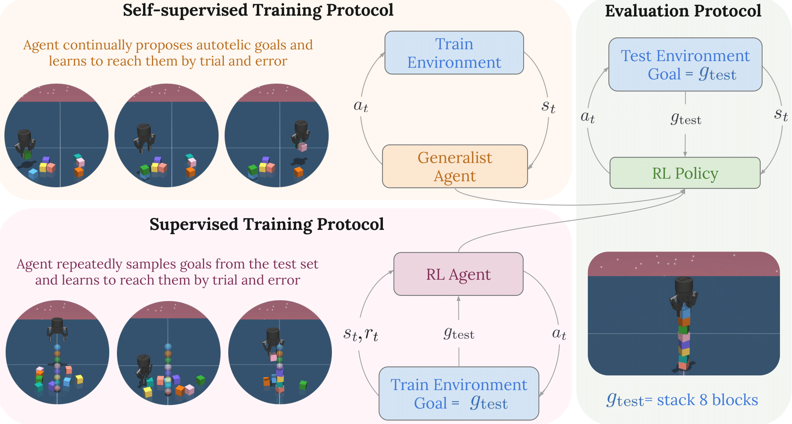

# BuilderBench

<p align="center">
  <em>Can AI models build a world which today's generative models can only dream of?</em>
</p>


BuilderBench is a benchmark designed to facilitate research on open-ended exploration, embodied reasoning and reinforcement learning (RL). Features include:

- A **parallelizable** and **hardware-accelerated** simulator built using [MuJoCo](https://github.com/google-deepmind/mujoco) and [Jax](https://github.com/jax-ml/jax). Training a PPO policy to pick and place a block takes less than 5 minutes on one GPU and twelve CPU threads.
- A task-suite of **42 ($\times$ 4 variations) tasks**, where each task requires qualitatively different reasoning capabilities.
- **Single file implementations** for two self-supervised RL and four RL algorithms in jax.

For more details, check out the [project website](https://rajghugare19.github.io/builderbench/) and [research paper](https://arxiv.org/abs/2510.06288).

## Installation

We have tested the installation on Ubuntu 22.04 and Ubuntu 24.04 using python 3.10.

### From source 

Clone the repository and enter the main folder. 

The main dependencies for BuilderBench environments is mujoco, jax, and optax. For installing the BuilderBench environments:

```shell
pip install -e .
```

For using reference implementations or developing new algorithms:

```shell
pip install -e ".[all]"
```

## Environments and Tasks

The environment consists of a robot hand that can navigate in 3D space and interact with a set of cube shaped blocks. A task corresponds to a physically stable target structure built using cubes. Tasks are specified using the positions of the blocks in the target structure. A central insight of builderbench is that despite this seemingly simple setup, tasks can be arbitrarily complex and long-horizon and can require multiple steps of high-level reasoning. The builderbench task suite consists of over 40 such carefully curated tasks. Check out the [project website](https://rajghugare19.github.io/builderbench/) for visualizations and the list of tasks. All tasks are defined in the [create_task_data.py](builderbench/create_task_data.py) file. 

## Simulator

The step function of the environment is parallelized using multi-thread pooling implemented by MuJoCo's [rollout](https://mujoco.readthedocs.io/en/stable/python.html#rollout) functionality in C++. The rest of the environment code is written in jax in a jit friendly manner. The rollout function is used as a [jax callback](https://docs.jax.dev/en/latest/_autosummary/jax.experimental.io_callback.html#jax.experimental.io_callback) and the environments can be compiled **end to end on jax**, enjoying the benefits of `jit` and `vmap`. For instance, a PPO policy can be trained in less than 5 minutes to successfully pick and place a cube. 

## Advantages of using MuJoCo Rollout
- Rollout uses MuJoCo's native simulation code written in C/C++. This circumvents issues faced by [MuJoCo MJX](https://mujoco.readthedocs.io/en/stable/mjx.html#mjx-the-sharp-bits) when running scenes with many contacts. This is true in the case of building with large number of blocks.
- [MuJoCo Warp](https://github.com/google-deepmind/mujoco_warp) allows scaling MuJoCo GPU simulation to much larger scenes. The main advantage of using MuJoCo Warp would be to run the environment completely on GPU and make the entire training loop simpler. **We have combined BuilderBench with MuJoCo Warp** in the warp branch. Currently, accurately simulating scenes and training using the warp backend is 5 times slower than rollout. This is for two main reasons. First, Warp is still in a beta release and some features have not been implemented (for example, the no slip solver). Second, we have not yet been able to tune the XML parameters to ensure training is both fast and accurate. **Reach out if you want to collaborate to make this happen.** The warp backend will become default once it is equally fast and if we are able to manually solve all tasks in the BuilderBench task-suite using it.

## Running experiments



To evaluate open-ended exploration, embodied reasoning and generalization, we design the self-supervised protocol. As shown in the figure, in this protocol agents have to explore the environment in a self-supervised manner and learn policies that can solve unseen tasks at test time. We also provide a debug single-task supervised protocol meant to provide additional feedback for researchers. In this protocol, agents are trained and tested on the same task.

### Self-supervised protocol

Use the following command to run the MEGA algorithm in an environment with two cube. The policy will be evaluated in fixed intervals, on all tasks in the task-suite that correspond to two cubes.

```bash
cd impls
python play_ppo_mega.py --env_id=cube-2-play
```

### Supervised protocol

Use the following command to run the PPO algorithm on the first task in an environment with one cube. The policy will be evaluated in fixed intervals on the same task.

```bash
cd impls
python ppo.py --env_id=cube-1-task1
```

## Visualization

By default, training runs will store checkpoints at regular intervals in a `impls/checkpoint/` folder. To visualize how these checkpoints perform, we have provided code in [impls/video.py](https://github.com/RajGhugare19/build-stuff/blob/main/impls/video.py). This file will iterate over all the training runs present in the given folder (`impls/checkpoint/` by default) and record and save a video for all the checkpoints of every training run. The code uses PPO's checkpoints as an example, but other algorithms can be visualized similarly. 

## Code Structure

The core structure of the codebase is as follows:

- `builderbench/`
  - `assets/` assets for defining MuJoCo models
  - `tasks/` meta-data for all tasks
  - `xmls/` xml files for defining MuJoCo models
  - `constants.py` predefined constants used for the environment
  - `create_task_data.py` task definition and task data creation
  - `build_block.py` supervised singletask protocol environment definition
  - `build_block_play.py` self-supervised multitask protocol environment definition
  - `env_utils.py` environment utilities.
- `impls/`
  - `utils/`
    - `buffer.py` replay buffer for off policy algorithms
    - `evaluation.py` supervised singletask protocol evaluation
    - `evaluation_play.py` self-supervised multitask evaluation
    - `networks.py` network definitions
    - `running_statistics.py` normalization functions
    - `wrapper.py` environment wrappers
  - `crl.py` contrastive reinforcement learning : [https://arxiv.org/abs/2206.07568](https://arxiv.org/abs/2206.07568)
  - `play_ppo_goalkde.py` maximum entropy goal achievement: [https://arxiv.org/pdf/2007.02832](https://arxiv.org/pdf/2007.02832)
  - `play_ppo_sfl.py` sampling for learnability: [https://arxiv.org/abs/2408.15099](https://arxiv.org/abs/2408.15099)
  - `ppo.py` proximal policy optimization: [https://arxiv.org/abs/1707.06347](https://arxiv.org/abs/1707.06347)
  - `ppo_rnd.py`random network distillation: [https://arxiv.org/abs/1810.12894](https://arxiv.org/abs/1810.12894)
  - `sac.py` soft actor critic: [https://arxiv.org/abs/1801.01290](https://arxiv.org/abs/1801.01290)
  - `video.py` code to record videos of policy checkpoints

## Acknowledgements

1) [MuJoCo Playground](https://github.com/google-deepmind/mujoco_playground) for environment structuring.
2) [MuJoCo](https://github.com/google-deepmind/mujoco) for the multithreading rollout functionality.
3) [MuJoCo Menagerie](https://github.com/google-deepmind/mujoco_menagerie) for the robot hand model.
4) [Brax](https://github.com/google/brax) for reference proximal policy optimization (ppo) implementation.
5) [JaxGCRL](https://github.com/MichalBortkiewicz/JaxGCRL) for reference contrastive RL implementation.

## Citation

```bibtex
@misc{ghugare2025builderbench,
      title={BuilderBench -- A benchmark for generalist agents}, 
      author={Raj Ghugare and Catherine Ji and Kathryn Wantlin and Jin Schofield and Benjamin Eysenbach},
      year={2025},
      eprint={2510.06288},
      archivePrefix={arXiv},
      primaryClass={cs.AI},
      url={https://arxiv.org/abs/2510.06288}, 
}
```
